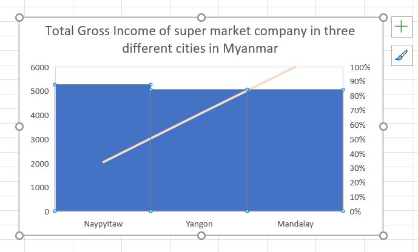

# map-reduce-venkatsaijarugula
Learning map reduce

## Description of data :
- The dataset consists of Historical record of sales data in 3 different supermarkets. The different attributes of data are Branch,City,Customer,Gender,Product_Line,Payment and Gross_Income
- I took the Dataset from ***[https://www.kaggle.com/aungpyaeap/supermarket-sales?select=supermarket_sales+-+Sheet1.csv](https://www.kaggle.com/aungpyaeap/supermarket-sales?select=supermarket_sales+-+Sheet1.csv)*** 

## Study:
- Using the super market dataset, I want to find the total gross amount from the  historical sales of supermarket company which has recorded in 3 different branches for 3 months data. 

## Execution process:
- At first, the 21mapper.py file maps and extracts the data from the supermarket_sales.csv  file.Later the output is sorted and sent to the 21reducer.py file, which reduces the data and adds data into the JarugulaVenkatSaiOutput.txt

## Powershell Command Used:
- ***cat supermarket_sales.csv | python 21mapper.py | sort | python 21reducer.py > VenkatSaiJarugulaOutput.txt***

## Summary of results:
- Initially there are 1000 rows of data in the dataset. After performing the map, sort and reduce operations on the dataset, I have obtained just 3 rows of data which is plotted in the below chart
- From the below chart, it can be observed that the city Naypyitaw has the maximum total gross income when compared to the other two states Mandalay and Yangon. 

